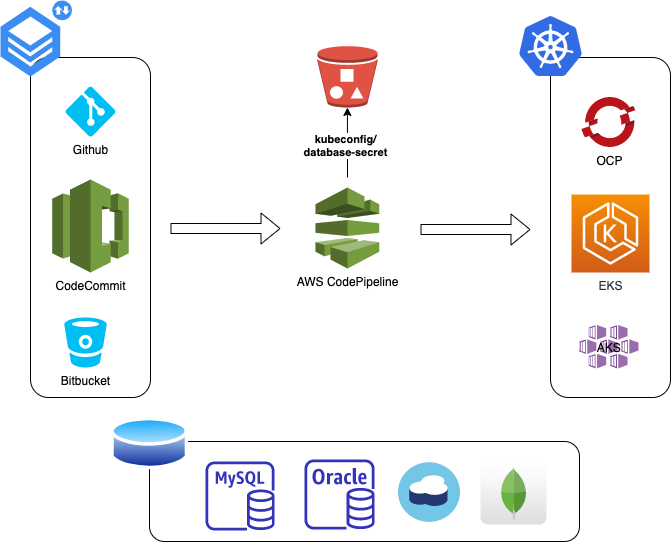
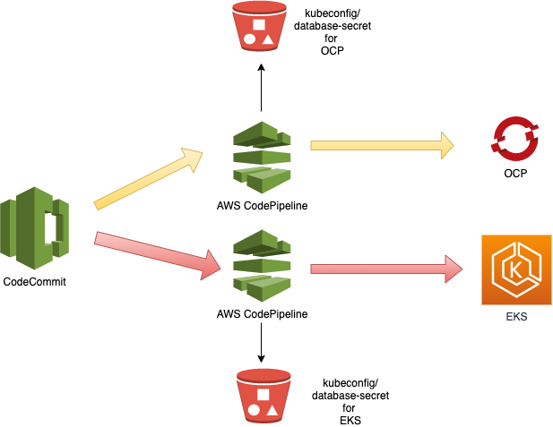
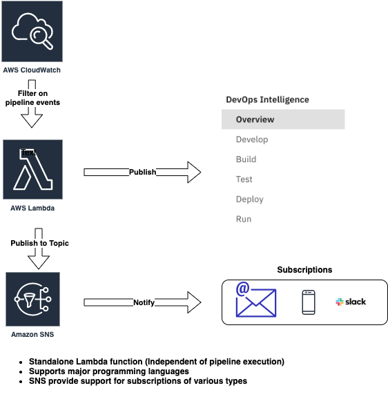

# AWS CI/CD pipeline with Kubernetes, Helm and MCMP integration

---
## Pipeline Overview 

---
## Deployment to multiple clusters

---
## MCMP integration - Build Instrumentation

## Instructions 
 [Provisioning AWS CI/CD Pipeline](<https://github.com/mcmpdemo/home/edit/master/README.md>)

## OpenShift Deployment 
   <https://github.com/mcmpdemo/home/tree/master/mcmp-demo-config-bucket/OCP>
   1. kubeconfig.yaml
   2. database-secret.yaml (optional)
   
## EKS Deployment
   <https://github.com/mcmpdemo/home/tree/master/mcmp-demo-config-bucket/EKS>
   1. kubeconfig.yaml
   2. database-secret.yaml (optional)
   3. credentials
   4. config

