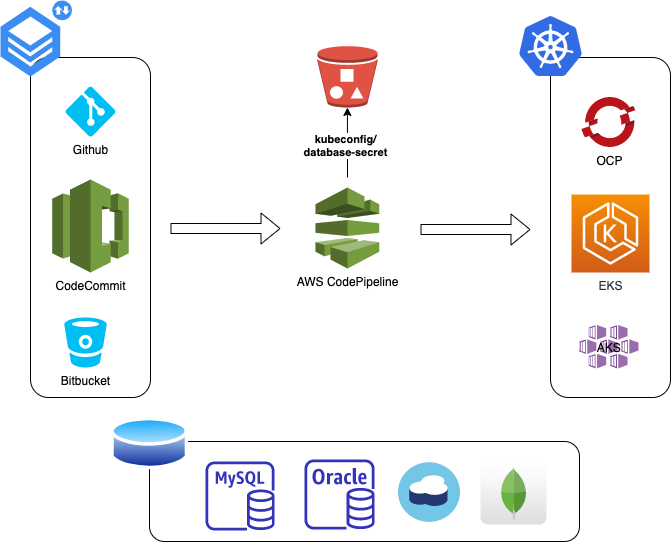
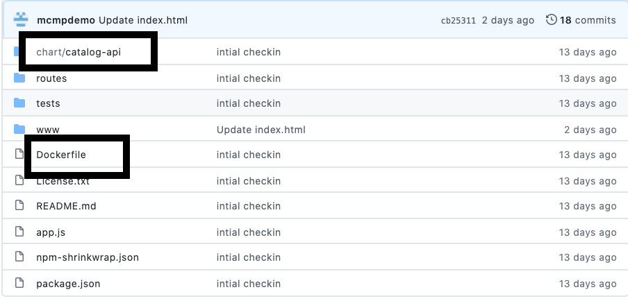

# AWS CI/CD Pipeline with Kubernetes, Helm and MCMP Integration

---
## Pipeline Overview 

---
## Deployment to Multiple Clusters

---
## MCMP Integration - Build Instrumentation

## Instructions - Provisioning AWS CI/CD Pipeline
   The pipeline is designed to integrate with source code repository that contains a docker based application/microservice and deployed using helm chart.
   It is currently tested with GitHub repository and deployment to OpenShift/AWS-EKS Kubernetes clusters.
   ### Pre-requisites
   1. AWS Account
   2. MCMP Account
   3. MCMP Token to publish build 
   4. DockerHub Account
   5. GitHub Account
   6. GitHub Personal Access Token: [How to create access token](https://docs.github.com/en/github/authenticating-to-github/creating-a-personal-access-token) 
   7. Kubernetes Cluster - OCP or EKS  (See below for sample kubeconfig.yaml) 
   8. Git repository with DockerFile and helm chart (see below instructions to clone sample repository)
        
        
  ### Quick start with Sample Repositories
   The following sample repositories are availble for practice and can be forked to your github account
   1. Login to your github account
   2. Go to one of the following repo links
   3. Select **Fork** button at the right hand side of the portal 
    
   [catalog-api](https://github.com/mcmpdemoeng/aws-catalog-api) 
   [orders-api](https://github.com/mcmpdemoeng/aws-orders-api) 
   [ui](https://github.com/mcmpdemoeng/aws-ui)
    
      
  ### OpenShift Deployment 
   The following configuration files are required. You can upload configuration files to an S3 bucket or place it at the root directory of repository.
   1. kubeconfig.yaml
   2. database-secret.yaml (optional)
   
   Sample OCP configuration files: <https://github.com/mcmpdemo/home/tree/master/mcmp-demo-config-bucket/OCP>
   
   
  ### EKS Deployment
  The following configuration files are required. You can upload configuration files to an S3 bucket or place it at the root directory of repository.
   
   1. kubeconfig.yaml
   2. database-secret.yaml (optional)
   3. credentials
   4. config
   
   Sample EKS configuration files: <https://github.com/mcmpdemo/home/tree/master/mcmp-demo-config-bucket/EKS>
   
  ### Provisioning Pipeline
  
   **From MCMP console**
   1. Login to MCMP
   2. Select **Enterprise Marketplace** => **Catalog**
   3. Select **AWS CI/CD Pipeline** => **Configure**
   
   **From AWS console**  
   1. Sign in to AWS console 
   2. Select Launch button 
   
   
   

