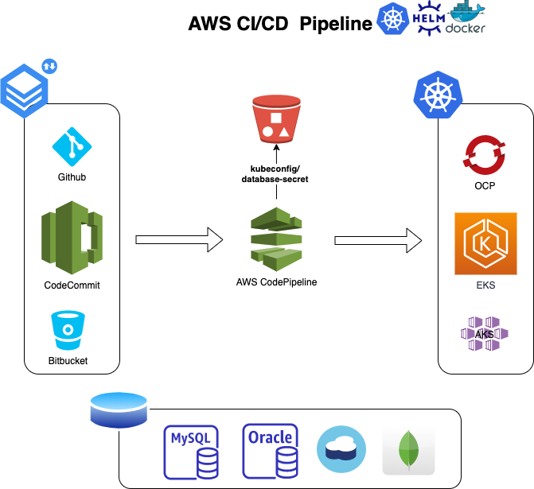
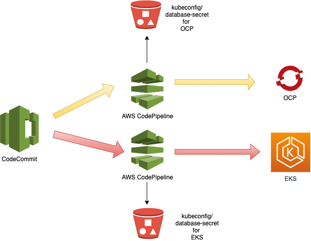
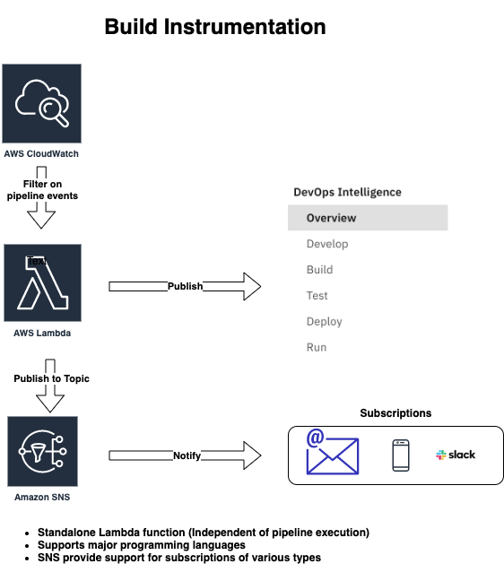

# AWS CI/CD pipeline with Kubernetes, Helm and MCMP integration

## For OpenShift and EKS clusters (mcmp-demo-config-bucket)
   1. kubeconfig.yaml
   2. database-secret.yaml
   
## Additional EKS configurationf files
   1. credentials
   2. config

## Pipeline Overview 

## Deploymnet to multiple clusters

## MCMP integration

